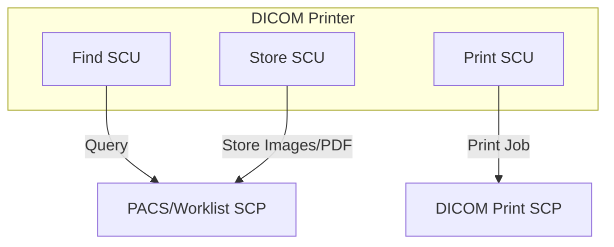

# DICOM 3.0 Conformance Statement

## N.0 Cover Page

- **Product Name:** DICOM Printer
- **Version:** 2.2
- **Vendor:** Flux Inc.
- **Date:** 2025-10-09
- **DICOM Standard Compliance:** PS3.2 2023d

© 2025 By Flux Inc. of Austin, Texas. All rights reserved.

## N.1 Conformance Statement Overview

This DICOM Conformance Statement specifies the behavior and functionality of the DICOM Printer application. This software provides the following features:

- Storage of images and presentation states on a remote DICOM system.
- Querying for data on a remote DICOM system.
- Printing of hardcopies on a remote DICOM print SCP.

**Table N.1-1: Overview of Network Services**

| SOP Class                                     | UID                           | SCU | SCP |
| --------------------------------------------- | ----------------------------- | --- | --- |
| **Verification**                              |                               |     |     |
| Verification                                  | 1.2.840.10008.1.1             | Yes | No  |
| **Transfer**                                  |                               |     |     |
| Secondary Capture Image Storage               | 1.2.840.10008.5.1.4.1.1.7     | Yes | No  |
| Encapsulated PDF Storage                      | 1.2.840.10008.5.1.4.1.1.104.1 | Yes | No  |
| **Query / Retrieve**                          |                               |     |     |
| Patient Root Query/Retrieve Information Model | 1.2.840.10008.5.1.4.1.2.1.1   | Yes | No  |
| Modality Worklist Information Model - FIND    | 1.2.840.10008.5.1.4.31        | Yes | No  |
| **Print Management**                          |                               |     |     |
| Basic Grayscale Print Management (Meta)       | 1.2.840.10008.5.1.1.9         | Yes | No  |
| Basic Color Print Management (Meta)           | 1.2.840.10008.5.1.1.18        | Yes | No  |

## N.2 Table of Contents

- [N.0 Cover Page](#n0-cover-page)
- [N.1 Conformance Statement Overview](#n1-conformance-statement-overview)
- [N.2 Table of Contents](#n2-table-of-contents)
- [N.3 Introduction](#n3-introduction)
- [N.4 Networking](#n4-networking)
- [N.5 Media Storage](#n5-media-storage)
- [N.6 Support of Character Sets](#n6-support-of-character-sets)
- [N.7 Security](#n7-security)
- [N.8 Annexes](#n8-annexes)

## N.3 Introduction

Flux DICOM Printer 2 (DP2) is a DICOM enabler, designed to fit into existing healthcare network infrastructure and add DICOM-compliant query and storage functionality to devices that presently lack this capability. As such, DP2 permits the querying of remote data and associated remote storage of printed documents and images on an existing PACS. For this purpose, DP2 utilizes the DICOM 3.0 protocol to perform both query and store operations against compliant devices.

### N.3.1 Revision History

**Table N.3-1: Revision History**

| Version  | Date       | Changes                                                                                         |
| -------- | ---------- | ----------------------------------------------------------------------------------------------- |
| 2.0 Beta | 2008.08.16 | First revision                                                                                  |
| 2.0.0    | 2008.10.31 | Implemented suspension for all AEs and added Modality Worklist Information Model - FIND support |
| 2.2      | 2025-10-09 | Added support for Encapsulated PDF Storage and advanced Color Support/Transfer Syntaxes.        |

### N.3.2 Audience

This document is written for the people that need to understand how DP2 will integrate into their healthcare facility. This includes both those responsible for overall imaging network policy and architecture, as well as integrators who need to have a detailed understanding of the DICOM features of the product. This document contains some basic DICOM definitions so that any reader may understand how this product implements DICOM features. However, integrators are expected to fully understand all the DICOM terminology, how the tables in this document relate to the product's functionality, and how that functionality integrates with other devices that support compatible DICOM features.

### N.3.3 Remarks

The scope of this DICOM Conformance Statement is to facilitate integration between DP2 and other DICOM products. The Conformance Statement should be read and understood in conjunction with the DICOM Standard. DICOM by itself does not guarantee interoperability.

The Conformance Statement does, however, facilitate a first-level comparison for interoperability between different applications supporting compatible DICOM functionality. This Conformance Statement is not supposed to replace validation with other DICOM equipment to ensure proper exchange of intended information. In fact, the user should be aware of the following important issues:

- The comparison of different Conformance Statements is just the first step towards assessing interconnectivity and interoperability between the product and other DICOM conformant equipment.
- Test procedures should be defined and executed to validate the required level of interoperability with specific compatible DICOM equipment, as established by the healthcare facility.

### N.3.4 Terms and Definitions

Informal definitions for the following terms used in this Conformance Statement are provided below. The DICOM Standard is the authoritative source for formal definitions of these terms.

- **[Abstract Syntax]** The information that is to be exchanged between applications, generally equivalent to a Service/Object Pair (SOP) Class. Examples: Verification SOP lass, Modality Worklist Information Model Find SOP Class, and Computed Radiography Image Storage SOP Class.
- **[Application Entity (AE)]** An end point of a DICOM information exchange, including the DICOM network or media interface software; i.e., the software that sends or receives DICOM information objects or messages. A single device may have multiple Application Entities.
- **[Application Entity Title]** he externally known name of an Application Entity, used to identify a DICOM application to other DICOM applications on the network.
- **[Application Context]** The specification of the type of communication used between Application Entities. Example: DICOM network protocol.
- **[Association]** A network communication channel set up between Application Entities.
- **[Attribute]** A unit of information in an object definition; a data element identified by a tag. The information may be a complex data structure (Sequence) composed of lower level data elements. Examples: Patient ID (0010,0020), Accession Number (0008,0050), Photometric Interpretation (0028,0004), and Procedure Code Sequence (0008,1032).
- **[Information Object Definition (IOD)]** The specified set of Attributes that comprise a type of data object; does not represent a specific instance of the data object, but rather a class of similar data objects that have the same properties. The Attributes may be specified as Mandatory (Type 1), required but possibly unknown (Type 2), or Optional (Type 3), and there may be conditions associated with the use of an Attribute (Types 1C and 2C). Examples: MR Image IOD, CT Image IOD, Print Job IOD.
- **[Joint Photographic Experts Group (JPEG)]** A set of standardized image compression techniques, available for use by DICOM applications.
- **[Media Application Profile]** The specification of DICOM information objects and encoding exchanged on removable media (e.g. CDs).
- **[Module]** A set of Attributes within an Information Object Definition that are logically related to each other. Example: Patient Module includes Patient Name, Patient ID, Patient Birth Date, and Patient Sex.
- **[Negotiation]** First phase of Association establishment that allows Application Entities to agree on the types of data to be exchanged and how that data will be encoded.
- **[Presentation Context]** The set of DICOM network services used over an Association, as negotiated between Application Entities; includes Abstract Syntaxes and Transfer Syntaxes.
- **[Protocol Data Unit (PDU)]** A packet (piece) of a DICOM message sent across the network. Devices must specify the maximum size packet they can receive for DICOM messages.
- **[Security Profile]** A set of mechanisms, such as encryption, user authentication, or digital signatures, used by an Application Entity to ensure confidentiality, integrity, and/or availability of exchanged DICOM data.
- **[Service Class Provider (SCP)]** Role of an Application Entity that provides a DICOM network service; typically, a server that performs operations requested by another Application Entity (Service Class User). Examples: Picture Archiving and Communication System (image storage SCP, and image query/retrieve SCP), Radiology Information System (modality worklist SCP).
- **[Service Class User (SCU)]** Role of an Application Entity that uses a DICOM network service; typically, a client. Examples: imaging modality (image storage SCU, and modality worklist SCU), imaging workstation (image query/retrieve SCU).
- **[Service/Object Pair (SOP) Class]** The specification of the network or media transfer (service) of a particular type of data (object); the fundamental unit of DICOM interoperability specification. Examples: Ultrasound Image Storage Service, Basic Grayscale Print Management.
- **[Service/Object Pair (SOP) Instance]** An information object; a specific occurrence of information exchanged in a SOP Class. Examples: a specific x-ray image.
- **[Tag]** A 32-bit identifier for a data element, represented as a pair of four digit hexadecimal numbers, the "group" and the "element". If the "group" number is odd, the tag is for a private (manufacturer-specific) data element. Examples: (0010,0020) [Patient ID], (07FE,0010) [Pixel Data], (0019,0210) [private data element].
- **[Transfer Syntax]** The encoding used for exchange of DICOM information objects and messages. Examples: JPEG compressed (images), Little Endian explicit value representation.
- **[Unique Identifier (UID)]** A globally unique "dotted decimal" string that identifies a specific object or a class of objects; an ISO-8824 Object Identifier. Examples: Study Instance UID, SOP Class UID, SOP Instance UID.
- **[Value Representation (VR)]** The format type of an individual DICOM data element, such as text, an integer, a person's name, or a code. DICOM information objects can be transmitted with either explicit identification of the type of each data element (Explicit VR), or without explicit identification (Implicit VR); with Implicit VR, the receiving application must use a DICOM data dictionary to look up the format of each data element.

### N.3.5 Basics of DICOM Communication

This section describes terminology used in this Conformance Statement for the non-specialist. The key terms used in the Conformance Statement are highlighted in italics below. This section is not a substitute for training about DICOM, and it makes many simplifications about the meanings of DICOM terms.

Two Application Entities (devices) that want to communicate with each other over a network using DICOM protocol must first agree on several things during an initial network "handshake". One of the two devices must initiate an Association (a connection to the other device), and ask if specific services, information, and encoding can be supported by the other device (Negotiation).

DICOM specifies a number of network services and types of information objects, each of which is called an Abstract Syntax for the Negotiation. DICOM also specifies a variety of methods for encoding data, denoted Transfer Syntaxes. The Negotiation allows the initiating Application Entity to propose combinations of Abstract Syntax and Transfer Syntax to be used on the Association; these combinations are called Presentation Contexts. The receiving Application Entity accepts the Presentation Contexts it supports.

For each Presentation Context, the Association Negotiation also allows the devices to agree on Roles - which one is the Service Class User (SCU - client) and which is the Service Class Provider (SCP - server). Normally the device initiating the connection is the SCU, i.e., the client system calls the server, but not always.

The Association Negotiation finally enables exchange of maximum network packet (PDU) size, security information, and network service options (called Extended Negotiation information).

The Application Entities, having negotiated the Association parameters, may now commence exchanging data. Common data exchanges include queries for worklists and lists of stored images, transfer of image objects and analyses (structured reports), and sending images to film printers. Each exchangeable unit of data is formatted by the sender in accordance with the appropriate Information Object Definition, and sent using the negotiated Transfer Syntax. There is a Default Transfer Syntax that all systems must accept, but it may not be the most efficient for some use cases. The receiver explicitly acknowledges each transfer with a Response Status indicating success, failure, or that query or retrieve operations are still in process.

Two Application Entities may also communicate with each other by exchanging media (such as a CD-R). Since there is no Association Negotiation possible, they both use a Media Application Profile that specifies "pre-negotiated" exchange media format, Abstract Syntax, and Transfer Syntax.

### N.3.6 Abbreviations

**Table N.3-2: Abbreviations and Acronyms**

| Abbreviation or Acronym | Definition                                      |
| ----------------------- | ----------------------------------------------- |
| AE                      | Application Entity                              |
| CDA                     | Clinical Document Architecture                  |
| CD-R                    | Compact Disk Recordable                         |
| CR                      | Computed Radiography                            |
| CT                      | Computed Tomography                             |
| DHCP                    | Dynamic Host Configuration Protocol             |
| DICOM                   | Digital Imaging and Communications in Medicine  |
| DIT                     | Directory Information Tree (LDAP)               |
| DNS                     | Domain Name System                              |
| HIS                     | Hospital Information System                     |
| HL7                     | Health Level 7 Standard                         |
| IHE                     | Integrating the Healthcare Enterprise           |
| IOD                     | Information Object Definition                   |
| IPv4                    | Internet Protocol version 4                     |
| IPv6                    | Internet Protocol version 6                     |
| ISO                     | International Organization for Standards        |
| JPEG                    | Joint Photographic Experts Group                |
| LUT                     | Look-up Table                                   |
| MTU                     | Maximum Transmission Unit (IP)                  |
| MWL                     | Modality Worklist                               |
| OSI                     | Open Systems Interconnection                    |
| PACS                    | Picture Archiving and Communication System      |
| PDU                     | Protocol Data Unit                              |
| RIS                     | Radiology Information System                    |
| SC                      | Secondary Capture                               |
| SCP                     | Service Class Provider                          |
| SCU                     | Service Class User                              |
| SOP                     | Service-Object Pair                             |
| SPS                     | Scheduled Procedure Step                        |
| TCP/IP                  | Transmission Control Protocol/Internet Protocol |

### N.3.7 References

**Table N.3-3: Documents Referenced in this Conformance Statement**

| Name     | Description                                                                                                   |
| -------- | ------------------------------------------------------------------------------------------------------------- |
| Nema PS3 | Digital Imaging and Communications in Medicine (DICOM) Standard, available free at <https://medical.nema.org/> |

## N.4 Networking

### N.4.1 Implementation Model

#### N.4.1.1 Application Data Flow Diagram

#### N.4.1.2 Functional Definitions of AEs

##### Find SCU

The user activates Find SCU in order to query for matching studies or worklist against one or more remote AEs. Requests are always handled synchronously.

##### Store SCU

Store SCU is initiated by the user, and activated in the background, always synchronously, when the user requests that images to be sent to a remote AE, which is selected from a configured list. Store SCU will only make a single attempt at association; if it fails, then another user request is required to commence another attempt.

##### Print SCU

Print SCU is an application entity that implements the DICOM Print Management Service Class as an SCU. The user activates PRINT SCU when a request to produce a hardcopy is made. When the user requests a print to a particular printer, PRINT SCU attempts to spool the print job. If DICOM Printer is terminated, the print job will continue to be transmitted until it is completed or aborted.

#### N.4.1.3 Sequencing of Real-World Activities

All activities occur in the sequence defined by user in configuration file. However, in a typical use, Query will precede store or print, and the later two are generally mutually exclusive.

### N.4.2 AE Specifications

#### Find SCU

##### SOP Classes

This application entity provides standard conformance to the DICOM SOP class given in Table N.4-1.

**Table N.4-1: SOP Classes for Find SCU**

| SOP Class                                     | UID                         | Role |
| --------------------------------------------- | --------------------------- | ---- |
| Patient Root Query/Retrieve Information Model | 1.2.840.10008.5.1.4.1.2.1.1 | SCU  |
| Modality Worklist Information Model - FIND    | 1.2.840.10008.5.1.4.31      | SCU  |

##### Association Policies

###### General

The DICOM standard application context name, which is always proposed, is `1.2.840.10008.3.1.1.1`.

###### Number of Associations

Find SCU will initiate a single association at a time.

###### Asynchronous Nature

Find SCU will only allow a single outstanding operation on an Association and does not support asynchronous operations window negotiation.

###### Implementation Identifying Information

- **Implementation Class UID:** Uses DCMTK default implementation class UID
- **Implementation Version Name:** Uses DCMTK default implementation version name
- **Private UID Root:** `1.2.826.0.1.3680043.2.1635` (used for internally generated UIDs)

##### Association Initiation Policy

Find SCU attempts to initiate a new association when a query action is reached in a user-defined workflow.

###### Activity - Query

- **Description:** A single attempt will be made to query the remote AE. If the query fails, it will be suspended or discarded based on the user-configured error handling strategy.

- **Proposed Presentation Contexts:**

**Table N.4-2: Proposed Presentation Contexts for Find SCU**

| Abstract Syntax (SOP Class UID) | Transfer Syntax (UID) | Role | Ext. Neg. |
|---|---|---|---|
| `1.2.840.10008.5.1.4.1.2.1.1` | `1.2.840.10008.1.2` (Implicit VR LE) | SCU | None |
| `1.2.840.10008.5.1.4.1.2.1.1` | `1.2.840.10008.1.2.1` (Explicit VR LE) | SCU | None |
| `1.2.840.10008.5.1.4.1.2.1.1` | `1.2.840.10008.1.2.2` (Explicit VR BE) | SCU | None |
| `1.2.840.10008.5.1.4.31` | `1.2.840.10008.1.2` (Implicit VR LE) | SCU | None |
| `1.2.840.10008.5.1.4.31` | `1.2.840.10008.1.2.1` (Explicit VR LE) | SCU | None |
| `1.2.840.10008.5.1.4.31` | `1.2.840.10008.1.2.2` (Explicit VR BE) | SCU | None |

- **SOP Specific Conformance for Patient Root Query/Retrieve:**
    - Supports query levels: Patient, Study, Series, Composite Object Instance (default is Study).
    - Supports all optional keys at each level (see PS3.4.C.6.1.1.2-5).
    - Does not generate relational queries.
    - Does not support extended negotiation for date-time or fuzzy name matching.
    - Does not use Specific Character Set for queries/responses.

- **SOP Specific Conformance for Modality Worklist:**
    - Supports matching on optional keys that are not in a sequence.
    - Does not support fuzzy person name matching.
    - Does not use Specific Character Set.

##### Association Acceptance Policy

Find SCU does not accept associations.

#### Store SCU

##### SOP Classes

**Table N.4-3: SOP Classes for Store SCU**

| SOP Class                       | UID                           | Role |
| ------------------------------- | ----------------------------- | ---- |
| Secondary Capture Image Storage | 1.2.840.10008.5.1.4.1.1.7     | SCU  |
| Encapsulated PDF Storage        | 1.2.840.10008.5.1.4.1.1.104.1 | SCU  |

##### Association Policies

(Same as Find SCU)

##### Association Initiation Policy

###### Activity - Send Images/PDFs

- **Description:** A single attempt will be made to store the image/PDF. Failure handling (retry/abort) is user-configurable.

- **Proposed Presentation Contexts:** The user can configure one of the following groups of transfer syntaxes to be proposed.

**Table N.4-4: Proposed Presentation Contexts for Store SCU**

| Group | Transfer Syntax | UID |
|---|---|---|
| 1 (Uncompressed) | Implicit VR LE | `1.2.840.10008.1.2` |
| | Explicit VR LE | `1.2.840.10008.1.2.1` |
| | Explicit VR BE | `1.2.840.10008.1.2.2` |
| 2 (RLE) | (All from Group 1) | |
| | RLE Lossless | `1.2.840.10008.1.2.5` |
| 3 (JPEG Lossy) | (All from Group 1) | |
| | JPEG Baseline (P1) | `1.2.840.10008.1.2.4.50` |
| 4 (JPEG Lossless) | (All from Group 1) | |
| | JPEG Lossless (P14, SV1) | `1.2.840.10008.1.2.4.70` |

##### Association Acceptance Policy

Store SCU does not accept associations.

#### Print SCU

##### SOP Classes

**Table N.4-5: SOP Classes for Print SCU**

| SOP Class                             | UID                    | Role |
| ------------------------------------- | ---------------------- | ---- |
| Basic Grayscale Print Management Meta | 1.2.840.10008.5.1.1.9  | SCU  |
| Basic Color Print Management Meta     | 1.2.840.10008.5.1.1.18 | SCU  |

##### Association Policies

(Same as Find SCU)

##### Association Initiation Policy

###### Activity - Print

- **Description:** A single attempt will be made to print. Failure handling is user-configurable.
- **Proposed Presentation Contexts:** Proposes uncompressed transfer syntaxes (Implicit VR LE, Explicit VR LE/BE).

- **SOP Specific Conformance:**
    - **Basic Film Session:** Uses N-CREATE and N-ACTION.
    - **Basic Film Box:** Uses N-CREATE.
    - **Basic Image Box:** Uses N-SET.

##### Association Acceptance Policy

Print SCU does not accept associations.

### Network Interfaces

#### Physical Network Interface

The application is indifferent to the physical medium over which TCP/IP executes; it depends on the underlying operating system and hardware.

#### Additional Protocols

No additional protocols are supported.

#### IPv4 and IPv6 Support

This product supports both IPv4 and IPv6. It does not utilize any of the optional configuration, identification, or security features of IPv6.

### Configuration

> **See also:** The [Configuration File Tags Specification](/dicom-printer-2/config) provides a complete reference for all XML configuration elements, and the [DP2 Operator Guide](/dicom-printer-2/) covers installation and operational procedures.

#### AE Title/Presentation Address Mapping

The Calling AE Title of the local application is configurable. The mapping of logical names for remote AEs to their Called AE Titles and presentation addresses (hostname/IP address and port) is also configurable.

#### Parameters

**Table N.4-6: Configuration Parameters**

| Parameter | Configurable | Default Value |
|---|---|---|
| **General** | | |
| PDU Size | Yes | 16 KB |
| Association Timeout | Yes | 1 s |
| DIMSE Timeout | Yes | 1 s |
| **AE Specific** | | |
| Max Object Size | No | Unlimited |
| Transfer Syntax Support | Yes | All proposed |

## N.5 Media Storage

This section is not applicable. The DICOM Printer does not support media storage services.

## N.6 Support of Character Sets

The application supports only `ISO_IR 100` (ISO 8859-1 Latin 1) as an extended character set.

## N.7 Security

It is assumed that DICOM Printer is used within a secured environment. It is assumed that a secured environment includes at a minimum:

- Firewall or router protections to ensure that only approved external hosts have network access to the application.
- Firewall or router protections to ensure that the application only has network access to approved external hosts.
- Any communication with external hosts and services outside the locally secured environment use appropriate secure network channels (e.g., a Virtual Private Network (VPN)).

Other network security procedures such as automated intrusion detection may be appropriate in some environments. Additional security features may be established by the local security policy and are beyond the scope of this conformance statement.

### N.7.1 Security Profiles

None supported.

### N.7.2 Association Level Security

None supported.

### N.7.3 Application Level Security

None supported.

## N.8 Annexes

### N.8.1 Color Support and Transfer Syntaxes

DICOM Printer supports multiple color modes and transfer syntaxes for both storage and printing operations, providing flexible image handling capabilities for various medical imaging workflows.

#### Color Mode Support

##### Store SCU Color Modes

The Store SCU supports three distinct color modes for DICOM Secondary Capture Image Storage:

**RGB Mode (24-bit Color)**

- Photometric Interpretation: RGB
- Samples Per Pixel: 3
- Bits Allocated: 8
- Bits Stored: 8
- High Bit: 7
- Planar Configuration: 0

**Monochrome8 Mode (8-bit Grayscale)**

- Photometric Interpretation: MONOCHROME2
- Samples Per Pixel: 1
- Bits Allocated: 8
- Bits Stored: 8
- High Bit: 7

**Monochrome12 Mode (12-bit Grayscale)**

- Photometric Interpretation: MONOCHROME2
- Samples Per Pixel: 1
- Bits Allocated: 16
- Bits Stored: 12
- High Bit: 11

##### Print SCU Color Modes

The Print SCU supports color printing through the DICOM Print Management Service:

**Color Print Mode**

- Supports Basic Color Print Management Meta SOP Class (1.2.840.10008.5.1.1.18)
- Full color printing capabilities via DICOM Print SCU

**Grayscale8 Print Mode**

- 8-bit grayscale printing
- Uses Basic Grayscale Print Management Meta SOP Class (1.2.840.10008.5.1.1.9)

**Grayscale12 Print Mode**

- 12-bit grayscale printing with enhanced dynamic range
- Uses Basic Grayscale Print Management Meta SOP Class (1.2.840.10008.5.1.1.9)

#### Transfer Syntax Support

DICOM Printer supports multiple transfer syntaxes for compressed and uncompressed data transmission:

##### Uncompressed Transfer Syntaxes

- Implicit VR Little Endian (1.2.840.10008.1.2)
- Explicit VR Little Endian (1.2.840.10008.1.2.1)
- Explicit VR Big Endian (1.2.840.10008.1.2.2)

##### Compressed Transfer Syntaxes

**RLE Lossless Compression**

- Transfer Syntax: RLE Lossless (1.2.840.10008.1.2.5)
- Supports all color modes
- Lossless compression suitable for diagnostic imaging

**JPEG Lossless Compression**

- Transfer Syntax: JPEG Lossless, Non-Hierarchical, First-Order Prediction (1.2.840.10008.1.2.4.70)
- Lossless compression maintaining full diagnostic quality
- Supports all color modes

**JPEG Lossy Compression**

- Transfer Syntax: JPEG Baseline (Process 1) (1.2.840.10008.1.2.4.50)
- Lossy compression for reduced file sizes
- Quality configurable for specific use cases

#### Color Processing and Conversion

##### Image Processing Pipeline

DICOM Printer includes sophisticated color processing capabilities:

**RGB to Grayscale Conversion**

- Uses weighted conversion algorithm for Monochrome8 mode
- Standard luminance formula: Y = 0.299R + 0.587G + 0.114B

**RGB to 12-bit Grayscale Conversion**

- Enhanced dynamic range conversion for Monochrome12 mode
- Two-step algorithm:
  1. Convert RGB to 8-bit grayscale using standard luminance: `gray8 = qGray(pixel)` (equivalent to `(R*11 + G*16 + B*5) / 32`)
  2. Expand 8-bit to 12-bit range: `gray12 = (gray8 << 4) | (gray8 >> 4)`
- The bit-expansion fills the lower 4 bits with the upper 4 bits of the 8-bit value, mapping the full 0-255 range smoothly onto 0-4095

**Color Manipulation Actions**

- Text overlay operations preserve color information
- Image rotation maintains color fidelity across all modes
- Trimming and resizing operations support full color processing
- Pixel data handling optimized for each color mode

##### DICOM Tag Handling

Color mode selection automatically configures appropriate DICOM tags:

- Photometric Interpretation
- Samples Per Pixel
- Bits Allocated/Stored/High Bit
- Planar Configuration (RGB mode only)
- Pixel Representation (always 0 for unsigned values)

#### Configuration and Usage

Color modes and transfer syntaxes are configurable through the XML configuration file, allowing administrators to optimize performance and quality for specific deployment scenarios. The application automatically handles pixel data conversion and DICOM tag population based on the selected color mode.